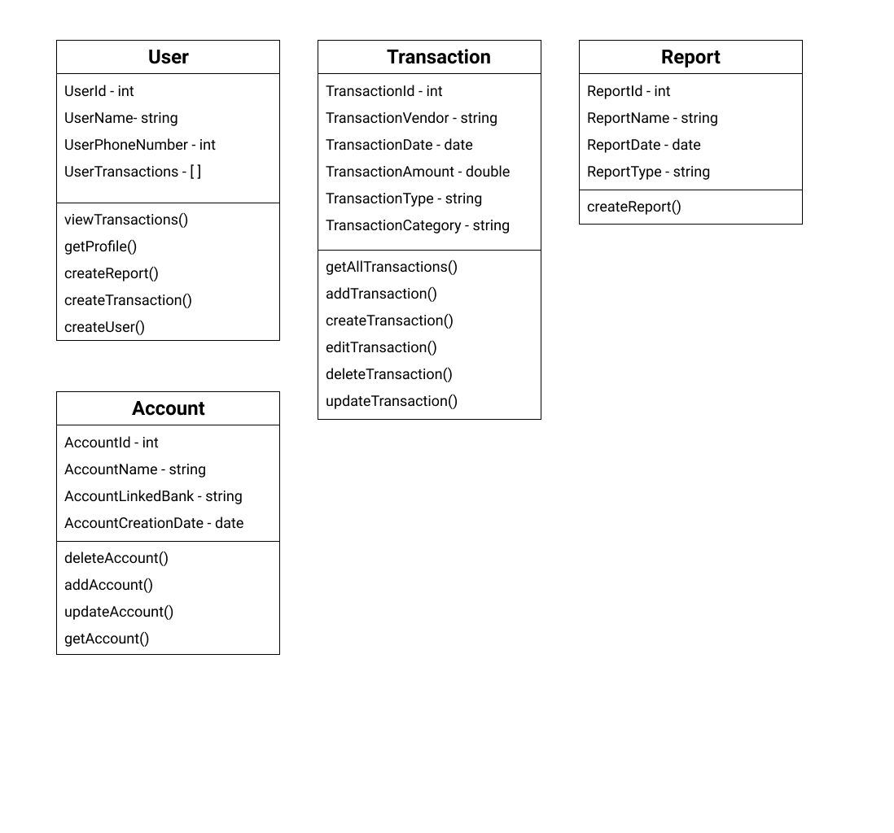

# Wearth
A web application that allows users to track their spending

## Features
- Adding, viewing, and editing recent transactions
- Generating reports of expenses

## To Run The Application
1. Run 
```bash
git clone https://github.com/YourEpicness/WearthTracker.git

cd WearthTracker

cd client

npm run start

cd ../server

npm run start
```

## UI Design
Home


## UML
